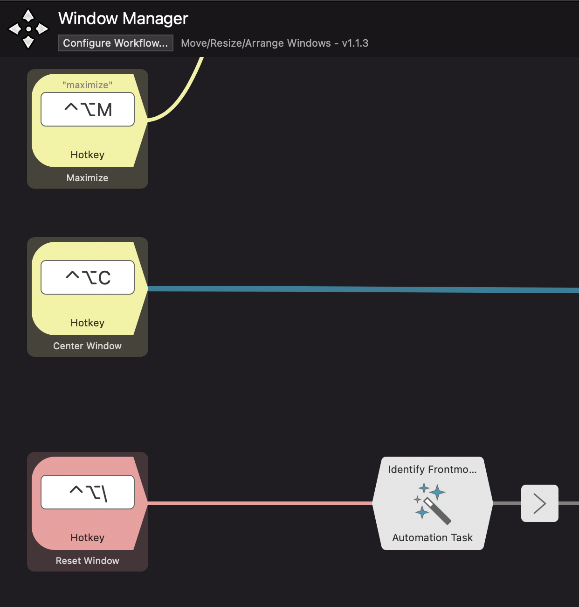

# Alfred Window Manager
Alfred Workflow to move/resize/position windows. 

**For actions like Left/Right Position, Maximize, and Center Two Thirds, the workflow saves the Window state so that you can restore it at any time.**

## Requirements

* [Automation Tasks](https://www.alfredapp.com/help/workflows/automations/automation-task/)

## Usage

* Use keyword `wm` to invoke Window Manager

### Keyboard shortcuts are suggestions:

*  ⇧↓ : Move to next screen
*  ⇧↑ : Move to previous screen
*  ^⌥M : Maximize
*  ^⌥C : Center Window
*  ^⌥← : Window to the left screen
*  ^⌥→ : Window to the right screen
*  ⌃⌥R : Reset Window
*  ⇧⌥W : Scale up window
*  ⇧⌥S : Scale down window
*  ⇧⌥D : Scale up right side of the window
*  ⇧⌥A : Scale up left side of the window
*  ⌥ A : Move window left
*  ⌥ D : Move window right
*  ⌥ W : Move window up
*  ⌥ S : Move window down